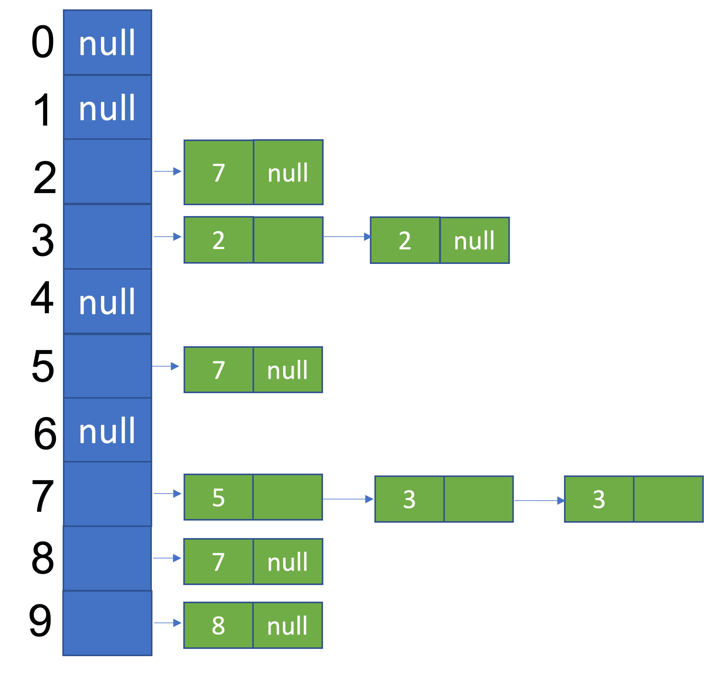
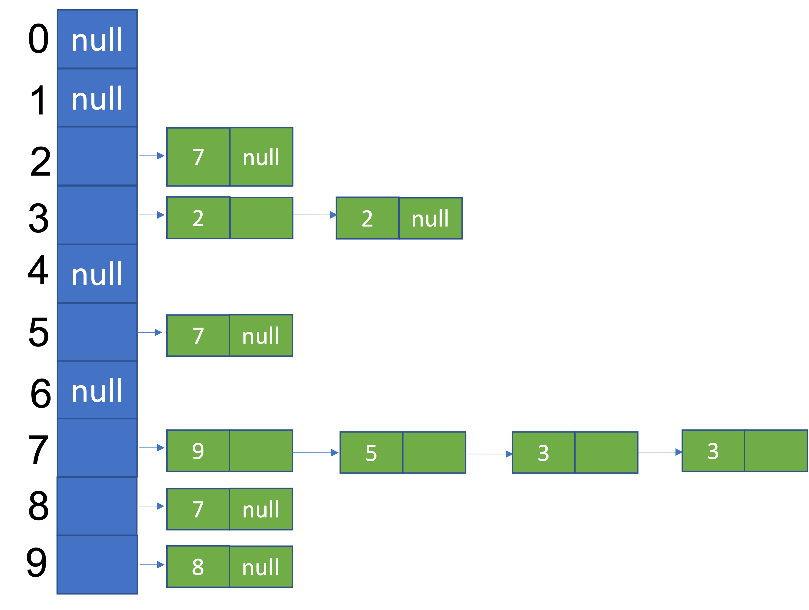

# CS 0445 – Algorithms and Data Structures 1 – Assignment#2 [^1]

**Due: Friday October 20th @ 11:59pm**

You should submit the file `LinkedDS.java` to GradeScope (the link is on
Canvas). You must also submit an Assignment Information Sheet `InfoSheet.md` as described in the Submission
Requirements section below.

**Late submission: Sunday October 22nd @11:59pm with 10% penalty per late day**

## TABLE OF CONTENTS

- [Overview](#overview)
- [Details](#Details)
- [Submission Requirements](#submission-requirements)
- [Rubrics](#rubrics)

## OVERVIEW

**Purpose:** To emphasize the object-oriented programming approach used in Java, and to practice working with linked lists. Specifically, you will work with control structures, class-building, interfaces and generics to create and utilize a linked data structure `LinkedDS<T>` that will act as a data structure for sequences of Java Objects. Your `LinkedDS<T>` class will primarily implement the interface `SequenceInterface<T>`. The details of the interface are explained in the file SequenceInterface.java. Read these files over very carefully before implementing `LinkedDS<T>`.

[^1]: Some text adapted from Dr. John Ramirez’s CS 0445 class.


## Details

For the details on the functionality of your `LinkedDS<T>` class, carefully read over the files
`SequenceInterface.java` and `A2Test.java`. You must use these files as specified and **cannot remove/alter any of
the code that is already written in them**. There are different ways of implementing the
`SequenceInterface<T>` methods, some of which are more efficient than
others. Your implementation should meet the ruuning times specified in the method comments inside `SequenceInterface.java`. A lot of pencil and paper work is
recommended before actually starting to write your code. Your `LinkedDS<T>` class header should be:

`public class LinkedDS<T> implements SequenceInterface<T> {`

**Important Note: The primary data within `LinkedDS<T>` class *must be* a one-dimensional
array of _linked lists_. You may not use any predefined Java collection class (e.g., `ArrayList`) for your `LinkedDS<T>` data
fields. You may not declare any one-dimensional arrays except for the alphabet and for the return value of any of the methods that return an array**.

You must use the following instance variables inside the `LinkedDS<T>` class:

```java
private Node[] array; //1-D array of linked lists
private int size; //the number of items in the sequence
private T[] alphabet; //the possible item values (e.g., the decimal digits)
private T firstItem; //the first item
private T lastItem; //the last item
```
You should define the inner `Node` class as below and add other variables and named constants to follow the secure programming practices we mentioned in class.

```java
private static class Node {
    private int item; //index in alphabet of item
    private Node next;

    private Node(int item){
        this.item = item;
        next = null;
    }
}
```

Besides the methods of `SequenceInterface<T>`, the following constructor is required:

```java
public LinkedDS(T[] alphabet)
```

To illustrate how to store a sequence of objects as a one-dimensional array of linked lists, let's have an example.

Let's take the sequence `9875732732` as an example. This is a sequence of decimal digits. The sequence
alphabet is the set of possible values from which the sequence items are drawn. So, in this example the
alphabet is the set of decimal digits `{0, 1, 2, 3, 4, 5, 6, 7, 8, 9}`. This sequence can be represented using the following
diagram.



Each of the ten digits of the alphabet is represented by an entry in an array of `Node` objects. Each entry in the array is the head of a linked list that contains the successors of an item in the sequence, sorted by their position in the sequence in ascending order. In the example, the first two lists are empty because 0 and 1 are not in the sequence `9875732732`. The node in the linked list for 2 represents that digit 2 is followed by digit 7 only once in the sequence. The linked list for 7 contains three nodes, because 7 in its three occurrences in the sequence `9875732732` is followed by 5, 3, and 3, in that order. Every pair of consecutive items in the sequence results in a node in the diagram.

Here are some properties of the sequence in the example above. Please match these with the methods
in `SequenceInterface.java`.

```java
first() == 9
last() == 2
size() == 10
isEmpty() == false
getFrequencyOf(3) == 2
getFrequencyOf(2) == 2
getFrequencyOf(7, 3) == 2 //73 appeared twice in the sequence
successors(7) == {5, 3} //5 and 3 are the unique items that immediately follow 7 in the sequence
```

The example sequence after `push(7)`, which inserts 7 at the beginning of the sequence changing it to `79875732732`, will look like:



Note the insertion of the node containing 9 (the previous first item) at the beginning of the linked list for 7 (the new first item).

Here are some properties of the sequence after `push(7)`. Please match these with the methods
in `SequenceInterface.java`.

```java
first() == 7
last() == 2
size() == 11
isEmpty() == false
getFrequencyOf(3) == 2
getFrequencyOf(2) == 2
getFrequencyOf(7, 3) == 2 //73 appeared twice in the sequence
successors(7) == {9, 5, 3} //9, 5, and 3 are the unique items that immediately follow 7 in the sequence
```

After you have finished coding of `LinkedDS<T>`, the `A2Test.java` file provided for you should compile and run correctly and should give output identical to the output shown in the file `A2Out.txt`. Please note that this statement doesn't suggest that you delay testing until you are done with all the methods of `LinkedDS`. Instead, you should use stubs and incrementally test your code using `A2Test.java` as you code up each of the methods.


## SUBMISSION REQUIREMENTS

The only source file that you can change is:

1. `LinkedDS.java`

You must submit the above file together with an edited version of `InfoSheet.md`.

The idea from your submission is that the autograder can compile and run A2Test **from the command line** WITHOUT ANY additional files or changes, so be
sure to test them thoroughly before submitting it.

**Note: If you use an IDE such as NetBeans, Eclipse, or IntelliJ, to develop your programs, make sure
they will compile and run on the command line before submitting – this may require some
modifications to your program (such as removing some package information).**


## RUBRICS

Please note that if an autograder is available, its score will be used as a guidance for the TA, not as an official final score. Please also note that the autograder rubrics are the definitive rubrics for the assignment. The rubrics below will be used by the TA to assign partial credit in case your code scored less than 40% of the autograder score. If your code is manually graded for partial credit, the maximum you can get for the autograded part is 60%.

| Item | Grade |
|------|-------|
|Constructor| 7|
|push() and pop() | 17 |
| size(), isEmpty(), first(), last() | 17 |
| The two versions of getFrequencyOf() | 17 |
| successors | 17 |
| Efficiency (meeting the running time specification) | 15 |
|-----|-----|
|Assignment Information Sheet and correct submission | 5 |
| javadoc comments and coding style (check Appendix A)  | 5 |
